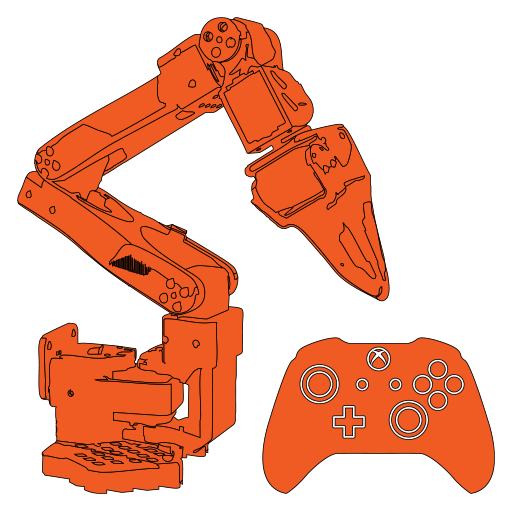

<!-- Project title -->
# Robot Arm Controller


<!-- Project description -->
This project simulates a robot arm using MuJoCo and Pygame. It reads inputs from an Xbox-Controller and updates the simulated robot's joints in real time.

<!-- Dependencies section: lists required libraries and installation command -->
## Dependencies

- Python 3.x
- [Pygame](https://www.pygame.org)
- [MuJoCo](https://mujoco.org)
- [NumPy](https://numpy.org)

Install dependencies via pip:
```bash
pip install pygame mujoco numpy
```

<!-- Usage section: provides instructions with alternative commands -->
## Usage

1. Connect an Xbox controller.
2. Ensure the MuJoCo model file is available at `robots\trs_so_arm100\scene.xml`.
3. Run the simulation:
```bash
python xbox_mujoco_soarm100.py
# or
python xbox_controller_phospho_soarm100.py
```

<!-- Project structure overview -->
## Project Structure

- `src/utils/simulation_process.py`: Main simulation loop using Pygame and MuJoCo.
- Other files and scripts can be added as needed.

<!-- Features section: describes control schemes and configuration -->
## Features

- **Analog Stick Control:**  
  - **Left Stick:**  
    - **Vertical Axis:** Controls forward/backward motion (affects the X-axis).
    - **Horizontal Axis:** Controls left/right motion (affects the Y-axis).
  - **Right Stick:**  
    - **Vertical Axis:** Controls up/down motion (affects the Z-axis).
- **Gripper Control:**  
  - **Right Trigger:** Adjusts the gripper position continuously based on how hard the trigger is pressed. A fully pressed trigger closes the gripper (0.0), and a released trigger keeps it open (1.0).
- **User Position Configuration:**  
  - At startup, you are prompted to enter **1** if you are behind the robot or **2** if you are facing the robot. This setting determines how the left stick inputs are mapped to the X and Y axes.

<!-- Prerequisites section -->
## Prerequisites

- Python 3.6+
- [pygame](https://www.pygame.org/) (for reading Xbox controller inputs)
- [requests](https://docs.python-requests.org/) (for HTTP requests)

<!-- Installation instructions -->
## Installation

1. **Clone the Repository:**

   ```bash
   git clone https://github.com/yourusername/robot-arm-controller.git
   cd robot-arm-controller
   ```
